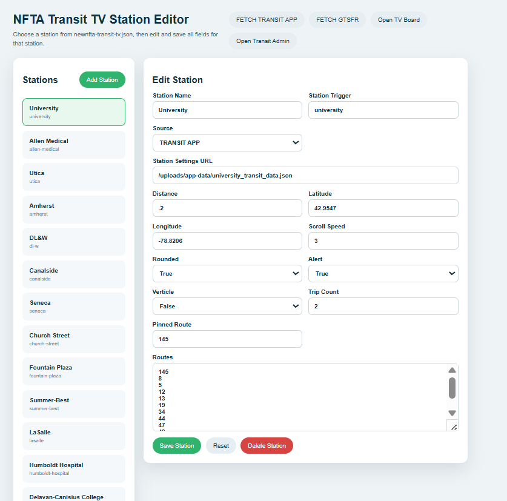
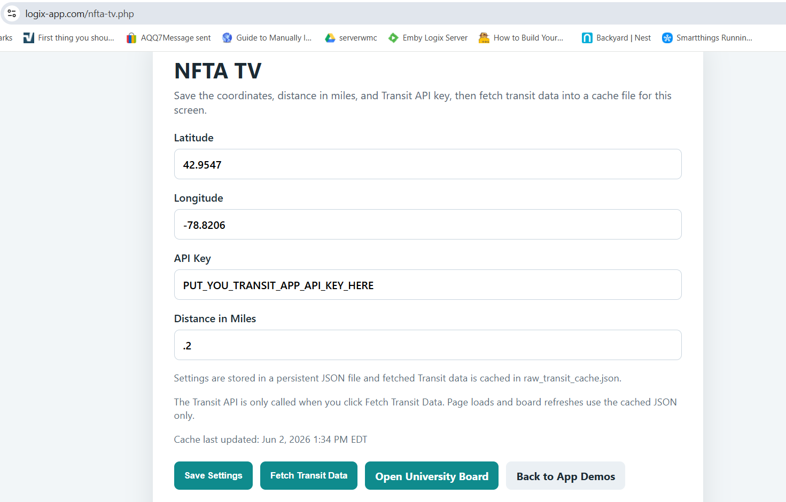
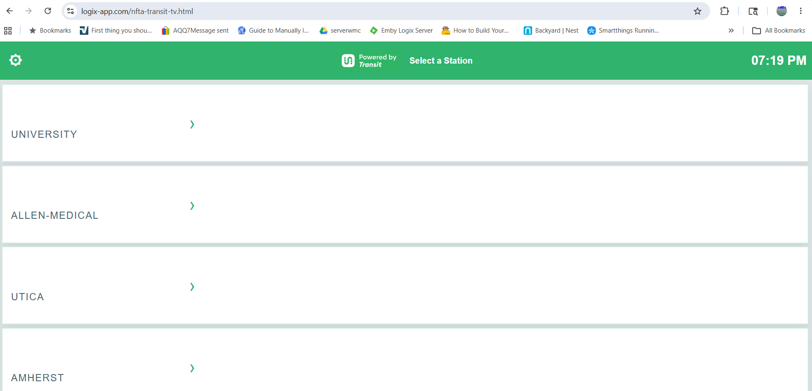
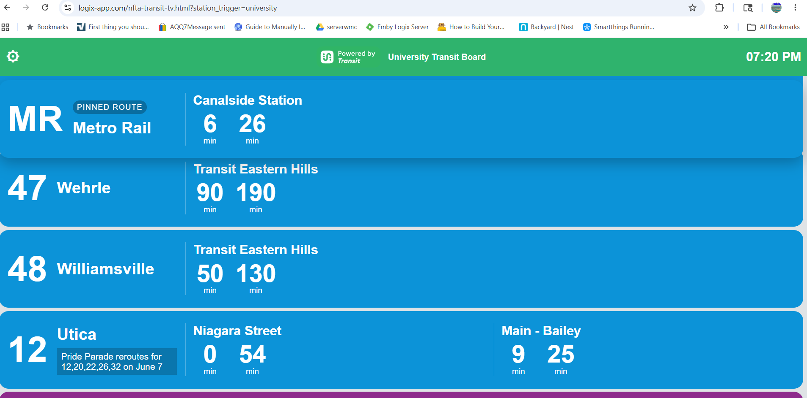

# NFTA Transit TV

A digital signage platform designed to display upcoming NFTA Metro bus and rail departures on station displays, kiosks, and information screens.

This project uses the Transit App API to retrieve nearby transit departures and presents the information through a configurable web-based display. While originally developed for NFTA Metro Rail stations, the architecture can be adapted for other transit systems that are supported by Transit App.

> **Note:** This repository represents a working implementation and may not exactly match the current production environment. Some supporting files, directory structures, and backend components used on the production server have been omitted or simplified.

---

## Overview

The system consists of three primary components:

1. **Data Collection** – Retrieves transit departure information from the Transit App API.
2. **Configuration Management** – Stores and manages station-specific display settings.
3. **Web Display Interface** – Presents departure information on public-facing displays.

---

## Data Collection

### `fetch_transit_data.py`

This script connects to the Transit App API and retrieves nearby transit departures for a specific location.

The script outputs the retrieved data to:

```text
raw_transit_cache.json
```

### Required Parameters

| Parameter      | Description               |
| -------------- | ------------------------- |
| `lat`          | Latitude of the station   |
| `lon`          | Longitude of the station  |
| `api-key`      | Transit App API key       |
| `radius-miles` | Search radius in miles    |
| `output-path`  | Output JSON file location |

### Operation

The intended deployment model is to execute this script approximately every 3 minutes for each station display.

Because the Transit App API requires a location-based search radius, each station must be queried independently using its own latitude and longitude coordinates.

---

## Station Configuration

Station-specific configuration data is stored in:

```text
stations.json
```

Each station entry contains the parameters required to retrieve and display transit information.

The parser can be executed using the configuration values stored for a selected station. In a production deployment, station records would ideally be managed through a backend administration interface rather than edited directly.

### Future Improvements

A complete implementation would include:

* Station creation and management
* Configuration editing
* Display customization
* Alert management
* API key administration

---

## Configuration Editor

### `nfta_transit_tv_station_editor.php`

A lightweight administration interface used to edit station configuration data.

Features include:

* Station configuration management
* Route selection
* Display settings
* Alert message configuration
* Layout customization

Screenshot:



---

## API Configuration Utility

### `nfta-tv.php`

A simple testing utility used to configure:

* Transit App API key
* Latitude
* Longitude
* Search radius

Screenshot:



---

## Data Sources

### Bus Departures

Bus departure information is retrieved in real time from the Transit App API.

### Rail Departures

Rail departure information is currently static schedule data.

Transit App does not differentiate between real-time and scheduled departures when serving this information, allowing both bus and rail departures to be presented through a common interface.

Future versions may support real-time rail information if it becomes available.

---

## Front-End Display

### `nfta-transit-tv.html`

The primary display interface.

When loaded without parameters, the page displays a list of all configured stations from `stations.json`.

Screenshot:



### Station Display Mode

A specific station can be loaded by supplying a station trigger parameter:

```text
nfta-transit-tv.html?station_trigger=university
```

Example:



A configuration gear icon is available in the upper-right corner to provide quick access to the station editor.

---

## Display Features

Several display customization options have been implemented.

### Layout Options

* Rounded or square information panels
* Landscape display mode
* Portrait display mode

### Transit Display Options

* Adjustable scroll speed
* Configurable trip count
* Route filtering
* Pinned routes

### Pinned Routes

Pinned routes remain fixed at the top of the display.

For NFTA Metro Rail deployments, the **MR-145** route can be configured as a pinned route to ensure rail departures are always displayed first.

### Alerts

Custom alert messages can be displayed, including:

* Elevator outages
* Escalator outages
* Service disruptions
* Special event notifications
* General rider information

---

## Screenshots

### Main Display


### University Station Example


### Station Configuration Editor


### API Configuration Utility


---

## Experimental Work

Several additional files included in this repository were created while testing alternative approaches using Google Transit APIs.

These files represent exploratory development and are not currently part of the primary Transit App implementation.

---

## Project Status

This project is functional and actively used as a transit information display platform. The current implementation focuses on practical deployment and operational use. Future development may include:

* Enhanced administrative tools
* Real-time rail integration
* Multi-agency support
* Improved configuration management
* Additional display layouts
* Centralized station administration
